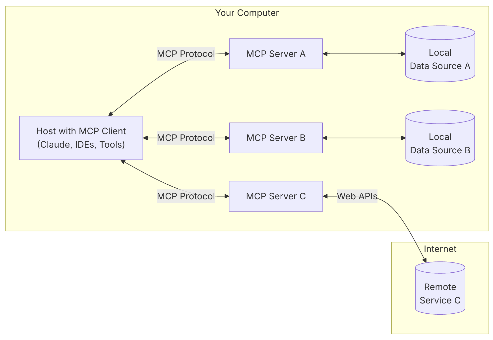

## Model Context Protocol (MCP)

### MCP Related Links
- Anthropic Article: https://www.anthropic.com/news/model-context-protocol
- MCP Website: https://modelcontextprotocol.io/introduction

### So What is MCP?
MCP a new standard for connecting AI assistants to the systems where data lives, including content repositories, business tools, and development environments. Its aim is to help frontier models produce better, more relevant responses.

It provides a universal, open standard for connecting AI systems with data sources, replacing fragmented integrations with a single protocol. The result is a simpler, more reliable way to give AI systems access to the data they need.

Instead of maintaining separate connectors for each data source, developers can now build against a standard protocol. As the ecosystem matures, AI systems will maintain context as they move between different tools and datasets, replacing today's fragmented integrations with a more sustainable architecture.

>Think of MCP like a USB-C port for AI applications. Just as USB-C provides a standardized way to connect your devices to various peripherals and accessories, MCP provides a standardized way to connect AI models to different data sources and tools.

### Why MCP?
MCP helps you build agents and complex workflows on top of LLMs. LLMs frequently need to integrate with data and tools, and MCP provides:

- A growing list of pre-built integrations that your LLM can directly plug into
- The flexibility to switch between LLM providers and vendors
- Best practices for securing your data within your infrastructure

### MCP Architecture
At its core, MCP follows a client-server architecture where a host application can connect to multiple servers:

## MCP Server

### Core MCP Concepts
MCP servers can provide three main types of capabilities:

- **Resources**: File-like data that can be read by clients (like API responses or file contents)
- **Tools**: Functions that can be called by the LLM (with user approval)
- **Prompts**: Pre-written templates that help users accomplish specific tasks

## MCP Development Tools (For Developers)
- MCP quickstart Guide: https://modelcontextprotocol.io/quickstart/server
- MCP specifications and SDK: https://github.com/modelcontextprotocol
- Open source repository of MCP Servers: https://github.com/modelcontextprotocol/servers

> Claude 3.5 Sonnet is adept at quickly building MCP server implementations, making it easy for organizations and individuals to rapidly connect their most important datasets with a range of AI-powered tools. To help developers start exploring, pre-built MCP servers for popular enterprise systems like Google Drive, Slack, GitHub, Git, Postgres, and Puppeteer are available in github repository.

